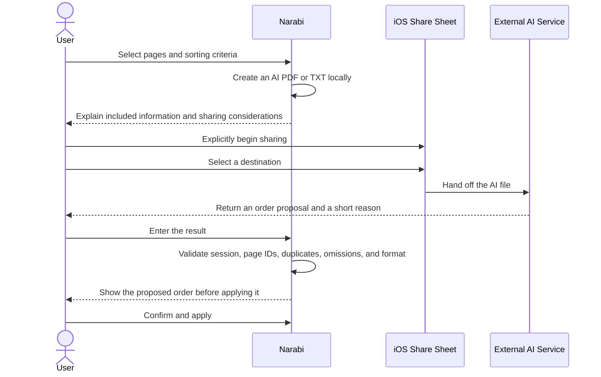

# AI handoff

```mermaid
sequenceDiagram
    actor U as User
    participant N as Narabi
    participant S as iOS Share Sheet
    participant X as External AI Service

    U->>N: Select pages and sorting criteria
    N->>N: Create an AI PDF or TXT locally
    N-->>U: Explain included information and sharing considerations
    U->>S: Explicitly begin sharing
    U->>S: Select a destination
    S->>X: Hand off the AI file
    X-->>U: Return an order proposal and a short reason
    U->>N: Enter the result
    N->>N: Validate session, page IDs, duplicates, omissions, and format
    N-->>U: Show the proposed order before applying it
    U->>N: Confirm and apply
```

Narabi does not connect directly to an external AI service and does not record the destination. An AI result never changes page order without validation and user confirmation.
