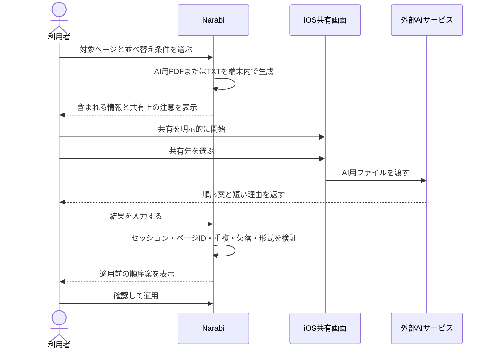

# AI受け渡し

```mermaid
sequenceDiagram
    actor U as 利用者
    participant N as Narabi
    participant S as iOS共有画面
    participant X as 外部AIサービス

    U->>N: 対象ページと並べ替え条件を選ぶ
    N->>N: AI用PDFまたはTXTを端末内で生成
    N-->>U: 含まれる情報と共有上の注意を表示
    U->>S: 共有を明示的に開始
    U->>S: 共有先を選ぶ
    S->>X: AI用ファイルを渡す
    X-->>U: 順序案と短い理由を返す
    U->>N: 結果を入力する
    N->>N: セッション・ページID・重複・欠落・形式を検証
    N-->>U: 適用前の順序案を表示
    U->>N: 確認して適用
```

Narabiは外部AIへ直接接続せず、共有先も記録しない。AI結果だけで順番を変更せず、形式検証と利用者の確認を必須にする。
