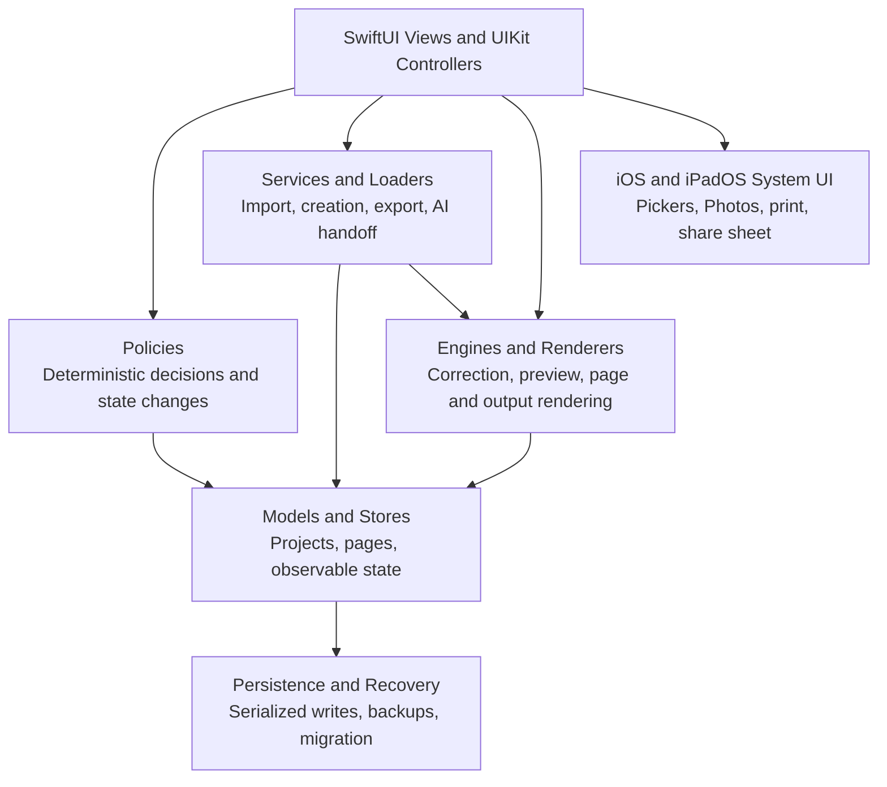

# Code Architecture

Representative policies include workspace layout and drag rules, project-browser selection and movement, import selection and format routing, page-edit results, placement, and composite-layout changes. `NewProjectImportItemLoader` performs staged import loading, and `DocumentCorrectionEngine` performs correction outside the editing view. UI code remains responsible for presentation and interaction timing.
