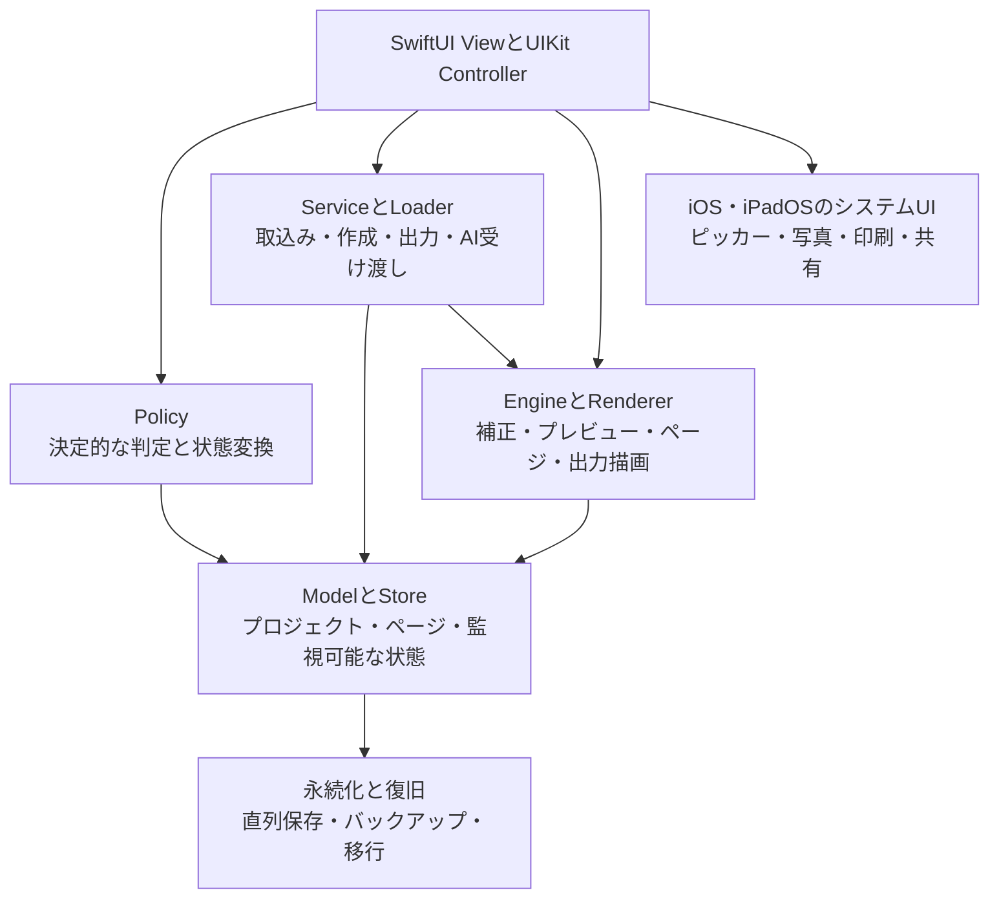

# コード構成

代表的なPolicyは、ワークスペースのレイアウトとドラッグ、プロジェクト一覧の選択と移動、取込み選択と形式経路、ページ編集結果、配置、重ね合わせ変更を担当します。`NewProjectImportItemLoader`は段階的な取込み読込みを、`DocumentCorrectionEngine`は編集画面の外で書類補正を担当します。画面コードは表示と操作タイミングの調停を担います。
