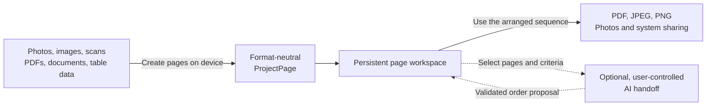

# Concept overview

Narabi converts mixed local material into format-neutral pages, organizes those pages in a persistent workspace, and lets the user take the arranged sequence out in the form they need.

AI remains outside the app's trust boundary. Narabi does not connect directly to an external AI service. The user selects the destination and reviews the returned result before applying it.
