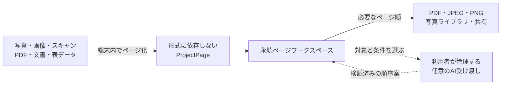

# コンセプト概要

Narabiは、形式の異なる資料を端末内の共通ページへ変換し、作業途中を保持できるページワークスペースで整理して、必要な形で取り出す。

```mermaid
flowchart LR
    Sources["写真・画像・スキャン<br/>PDF・文書・表データ"]
    Normalize["形式に依存しない<br/>ProjectPage"]
    Workspace["永続ページワークスペース"]
    Output["PDF・JPEG・PNG<br/>写真ライブラリ・共有"]
    AI["利用者が管理する<br/>任意のAI受け渡し"]

    Sources -->|端末内でページ化| Normalize
    Normalize --> Workspace
    Workspace -->|必要なページ順| Output
    Workspace -.->|対象と条件を選ぶ| AI
    AI -.->|検証済みの順序案| Workspace
```

AIは信頼境界の外にあり、Narabi自身は外部AIへ直接接続しない。利用者が共有先を選び、返却結果を確認してから適用する。
