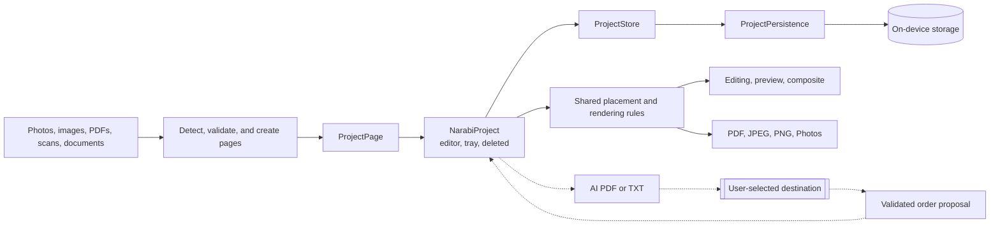

# Data flow

```mermaid
flowchart LR
    Sources["Photos, images, PDFs, scans, documents"] --> Import["Detect, validate, and create pages"]
    Import --> Page["ProjectPage"]
    Page --> Project["NarabiProject<br/>editor, tray, deleted"]
    Project --> Store["ProjectStore"]
    Store --> Persistence["ProjectPersistence"]
    Persistence --> Disk[("On-device storage")]
    Project --> Render["Shared placement and rendering rules"]
    Render --> Preview["Editing, preview, composite"]
    Render --> Export["PDF, JPEG, PNG, Photos"]
    Project -.-> AIFile["AI PDF or TXT"]
    AIFile -.-> Share[["User-selected destination"]]
    Share -.-> Validated["Validated order proposal"]
    Validated -.-> Project
```
