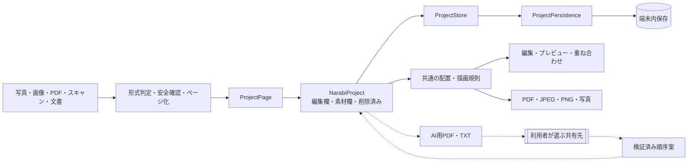

# データフロー

```mermaid
flowchart LR
    Sources["写真・画像・PDF・スキャン・文書"] --> Import["形式判定・安全確認・ページ化"]
    Import --> Page["ProjectPage"]
    Page --> Project["NarabiProject<br/>編集欄・素材欄・削除済み"]
    Project --> Store["ProjectStore"]
    Store --> Persistence["ProjectPersistence"]
    Persistence --> Disk[("端末内保存")]
    Project --> Render["共通の配置・描画規則"]
    Render --> Preview["編集・プレビュー・重ね合わせ"]
    Render --> Export["PDF・JPEG・PNG・写真"]
    Project -.-> AIFile["AI用PDF・TXT"]
    AIFile -.-> Share[["利用者が選ぶ共有先"]]
    Share -.-> Validated["検証済み順序案"]
    Validated -.-> Project
```
