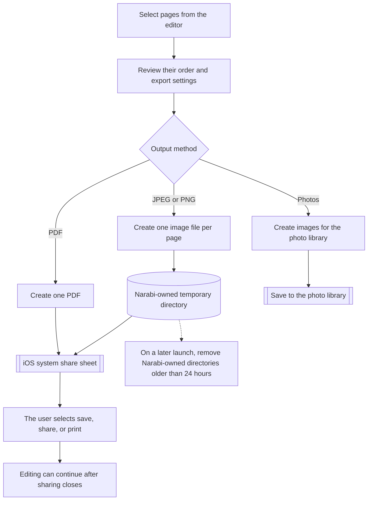

# Export pipeline

```mermaid
flowchart TD
    Select["Select pages from the editor"] --> Review["Review their order and export settings"]
    Review --> Method{"Output method"}
    Method -->|PDF| PDF["Create one PDF"]
    Method -->|JPEG or PNG| Images["Create one image file per page"]
    Method -->|Photos| Photos["Create images for the photo library"]
    PDF --> Share[["iOS system share sheet"]]
    Images --> Temp[("Narabi-owned temporary directory")]
    Temp --> Share
    Photos --> Library[["Save to the photo library"]]
    Share --> Destination["The user selects save, share, or print"]
    Destination --> Return["Editing can continue after sharing closes"]
    Temp -.-> Cleanup["On a later launch, remove Narabi-owned directories older than 24 hours"]
```

Image files are not deleted immediately when the share sheet closes, allowing the chosen destination to finish reading them.
