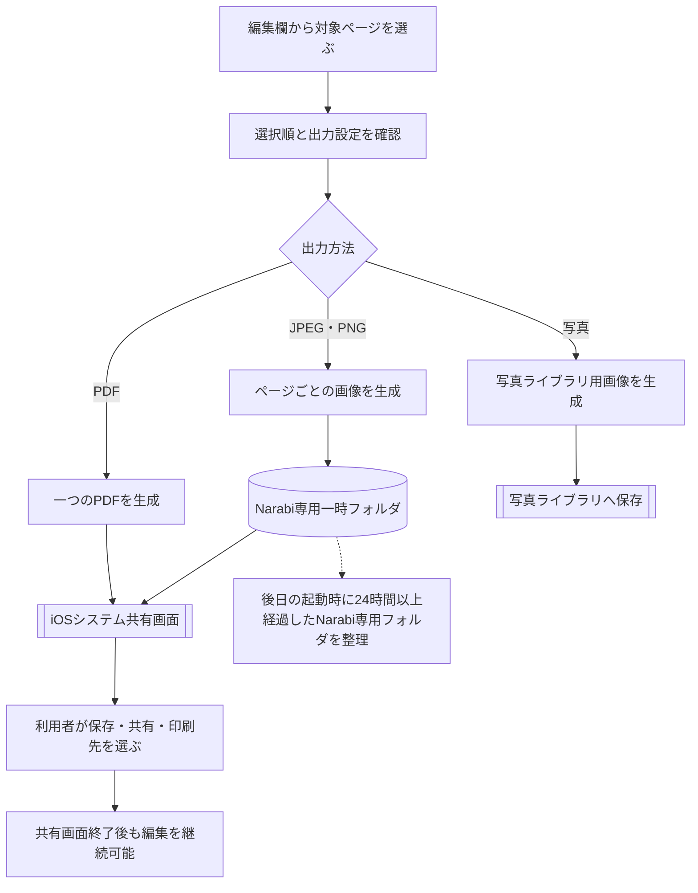

# 出力パイプライン

```mermaid
flowchart TD
    Select["編集欄から対象ページを選ぶ"] --> Review["選択順と出力設定を確認"]
    Review --> Method{"出力方法"}
    Method -->|PDF| PDF["一つのPDFを生成"]
    Method -->|JPEG・PNG| Images["ページごとの画像を生成"]
    Method -->|写真| Photos["写真ライブラリ用画像を生成"]
    PDF --> Share[["iOSシステム共有画面"]]
    Images --> Temp[("Narabi専用一時フォルダ")]
    Temp --> Share
    Photos --> Library[["写真ライブラリへ保存"]]
    Share --> Destination["利用者が保存・共有・印刷先を選ぶ"]
    Destination --> Return["共有画面終了後も編集を継続可能"]
    Temp -.-> Cleanup["後日の起動時に24時間以上経過したNarabi専用フォルダを整理"]
```

共有画面を閉じた直後には画像ファイルを削除せず、選択された共有先が読み終えられるようにする。
