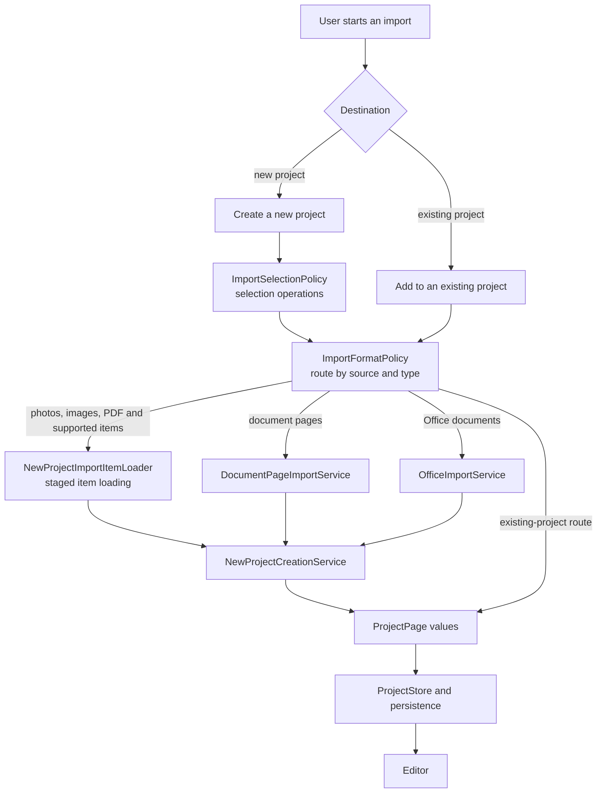

# Import Pipeline

New-project import and existing-project addition intentionally have different routing and fallback order. A document-import safety error is not silently redirected to an unrelated fallback. The UI presents progress and performs final registration, while policies, loaders, and services perform reusable decisions and conversion work.
