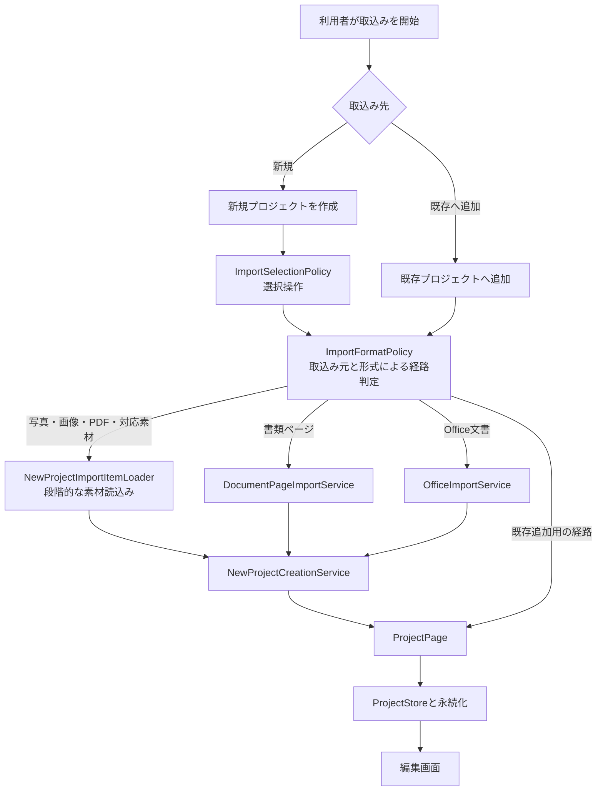

# 取込み処理

```mermaid
flowchart TD
    START[利用者が取込みを開始]
    ENTRY{取込み先}
    NEW[新規プロジェクトを作成]
    EXIST[既存プロジェクトへ追加]
    SELECT[ImportSelectionPolicy\n選択操作]
    FORMAT[ImportFormatPolicy\n取込み元と形式による経路判定]
    LOAD[NewProjectImportItemLoader\n段階的な素材読込み]
    DOC[DocumentPageImportService]
    OFFICE[OfficeImportService]
    CREATE[NewProjectCreationService]
    PAGES[ProjectPage]
    SAVE[ProjectStoreと永続化]
    EDITOR[編集画面]

    START --> ENTRY
    ENTRY -->|新規| NEW
    ENTRY -->|既存へ追加| EXIST
    NEW --> SELECT --> FORMAT
    FORMAT -->|写真・画像・PDF・対応素材| LOAD
    FORMAT -->|書類ページ| DOC
    FORMAT -->|Office文書| OFFICE
    LOAD --> CREATE
    DOC --> CREATE
    OFFICE --> CREATE
    CREATE --> PAGES --> SAVE --> EDITOR
    EXIST --> FORMAT
    FORMAT -->|既存追加用の経路| PAGES
```

新規プロジェクト作成と既存プロジェクトへの追加では、経路判定とフォールバック順序が意図的に異なります。書類取込みの安全性エラーは、無関係な方式へ黙って切り替えません。画面は進捗表示と最終登録を担い、Policy、Loader、Serviceが再利用可能な判定と変換を担当します。
