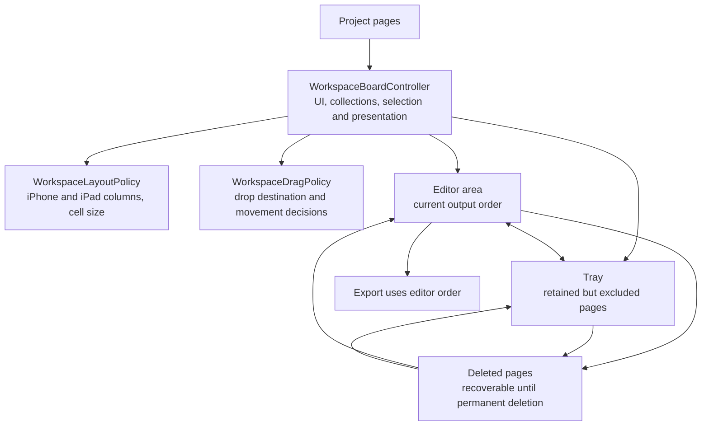

# Page Workspace

The extraction of layout and drag policies does not change the user-facing workspace behavior. The controller still coordinates scrolling, gestures, collection views, selection, and the tray; reusable calculations and decisions are covered independently by unit tests.
