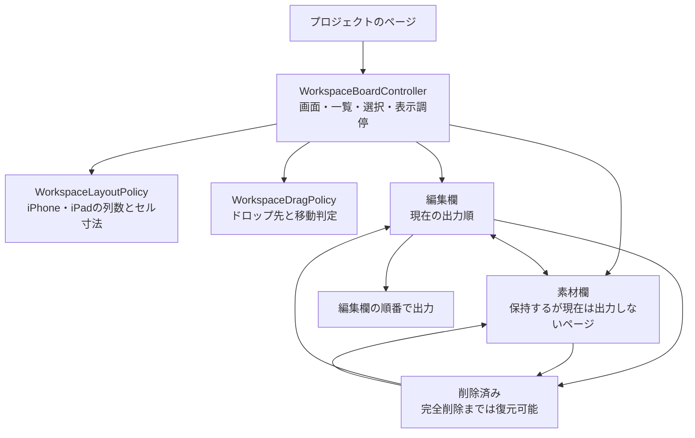

# ページワークスペース

```mermaid
flowchart TD
    PROJECT[プロジェクトのページ]
    BOARD[WorkspaceBoardController\n画面・一覧・選択・表示調停]
    LAYOUT[WorkspaceLayoutPolicy\niPhone・iPadの列数とセル寸法]
    DRAG[WorkspaceDragPolicy\nドロップ先と移動判定]
    EDIT[編集欄\n現在の出力順]
    TRAY[素材欄\n保持するが現在は出力しないページ]
    DELETED[削除済み\n完全削除までは復元可能]
    OUTPUT[編集欄の順番で出力]

    PROJECT --> BOARD
    BOARD --> LAYOUT
    BOARD --> DRAG
    BOARD --> EDIT
    BOARD --> TRAY
    EDIT <--> TRAY
    EDIT --> DELETED
    TRAY --> DELETED
    DELETED --> EDIT
    DELETED --> TRAY
    EDIT --> OUTPUT
```

レイアウトとドラッグのPolicy分離によって、利用者から見たワークスペース動作は変わりません。Controllerは引き続きスクロール、ジェスチャー、Collection View、選択、素材欄を調停し、再利用可能な計算と判定は単体テストで個別に確認します。
