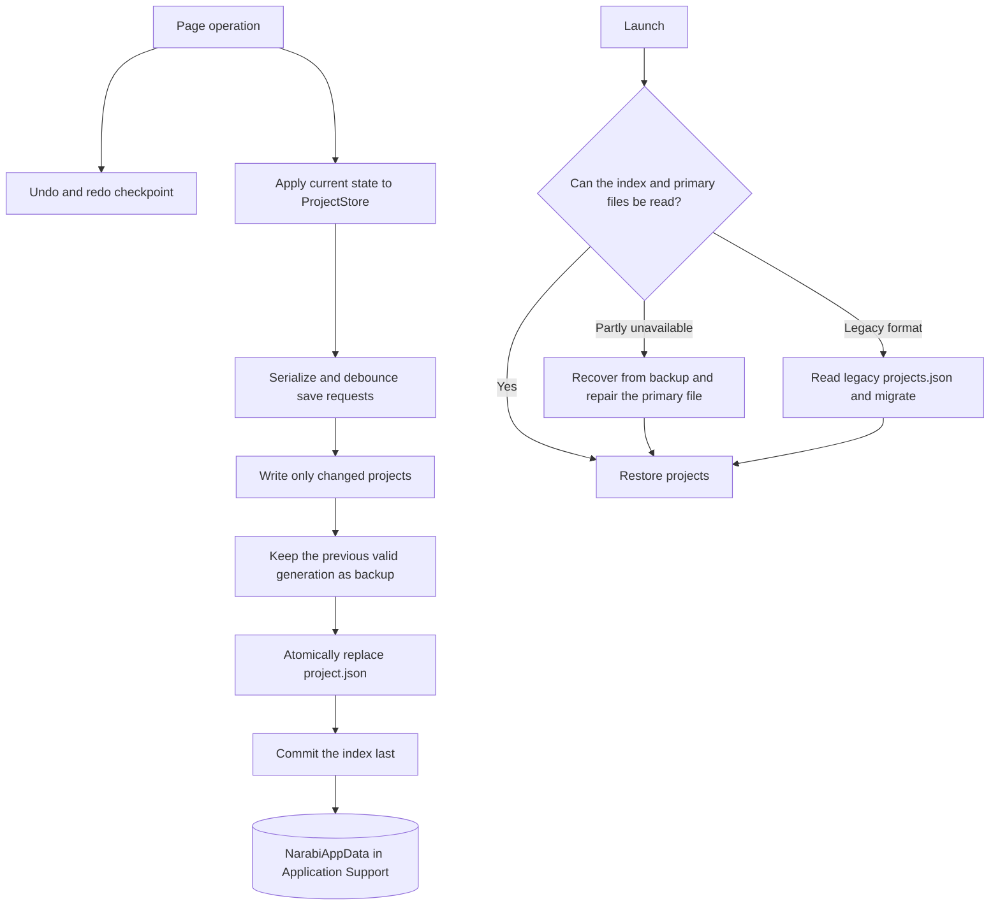

# Storage and recovery

```mermaid
flowchart TD
    Edit["Page operation"] --> Checkpoint["Undo and redo checkpoint"]
    Edit --> Store["Apply current state to ProjectStore"]
    Store --> Queue["Serialize and debounce save requests"]
    Queue --> Changed["Write only changed projects"]
    Changed --> Backup["Keep the previous valid generation as backup"]
    Backup --> Atomic["Atomically replace project.json"]
    Atomic --> Index["Commit the index last"]
    Index --> Disk[("NarabiAppData in Application Support")]

    Launch["Launch"] --> Read{"Can the index and primary files be read?"}
    Read -->|Yes| Ready["Restore projects"]
    Read -->|Partly unavailable| Recover["Recover from backup and repair the primary file"]
    Read -->|Legacy format| Migrate["Read legacy projects.json and migrate"]
    Recover --> Ready
    Migrate --> Ready
```

Persistent project storage, editing-session undo and redo, and temporary-export cleanup remain separate responsibilities.
