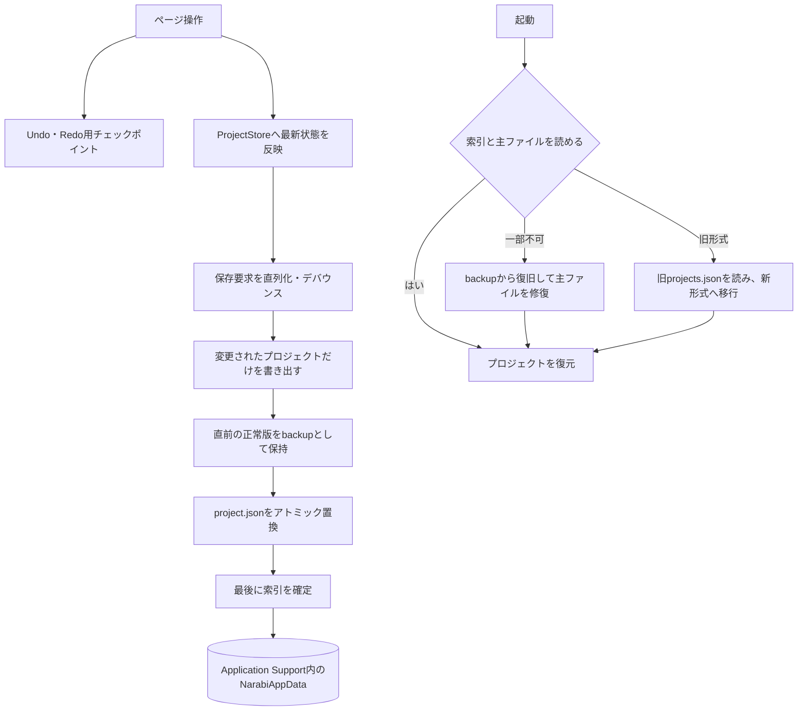

# 保存と復旧

```mermaid
flowchart TD
    Edit["ページ操作"] --> Checkpoint["Undo・Redo用チェックポイント"]
    Edit --> Store["ProjectStoreへ最新状態を反映"]
    Store --> Queue["保存要求を直列化・デバウンス"]
    Queue --> Changed["変更されたプロジェクトだけを書き出す"]
    Changed --> Backup["直前の正常版をbackupとして保持"]
    Backup --> Atomic["project.jsonをアトミック置換"]
    Atomic --> Index["最後に索引を確定"]
    Index --> Disk[("Application Support内のNarabiAppData")]

    Launch["起動"] --> Read{"索引と主ファイルを読める"}
    Read -->|はい| Ready["プロジェクトを復元"]
    Read -->|一部不可| Recover["backupから復旧して主ファイルを修復"]
    Read -->|旧形式| Migrate["旧projects.jsonを読み、新形式へ移行"]
    Recover --> Ready
    Migrate --> Ready
```

プロジェクトの保存、編集セッションのUndo・Redo、一時出力の整理は別々の責任として扱う。
