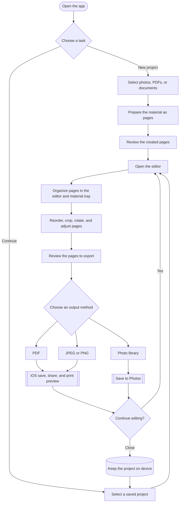

# User flow

```mermaid
flowchart TD
    Start(["Open the app"]) --> Choice{"Choose a task"}
    Choice -->|New project| Import["Select photos, PDFs, or documents"]
    Choice -->|Continue| Resume["Select a saved project"]
    Import --> Prepare["Prepare the material as pages"]
    Prepare --> Review["Review the created pages"]
    Resume --> Editor["Open the editor"]
    Review --> Editor
    Editor --> Organize["Organize pages in the editor and material tray"]
    Organize --> Edit["Reorder, crop, rotate, and adjust pages"]
    Edit --> Check["Review the pages to export"]
    Check --> Export{"Choose an output method"}
    Export --> PDF["PDF"]
    Export --> Images["JPEG or PNG"]
    Export --> Photos["Photo library"]
    PDF --> Share[["iOS save, share, and print preview"]]
    Images --> Share
    Photos --> SavedPhotos[["Save to Photos"]]
    Share --> Continue{"Continue editing?"}
    SavedPhotos --> Continue
    Continue -->|Yes| Editor
    Continue -->|Close| Stored[("Keep the project on device")]
    Stored --> Resume
```
