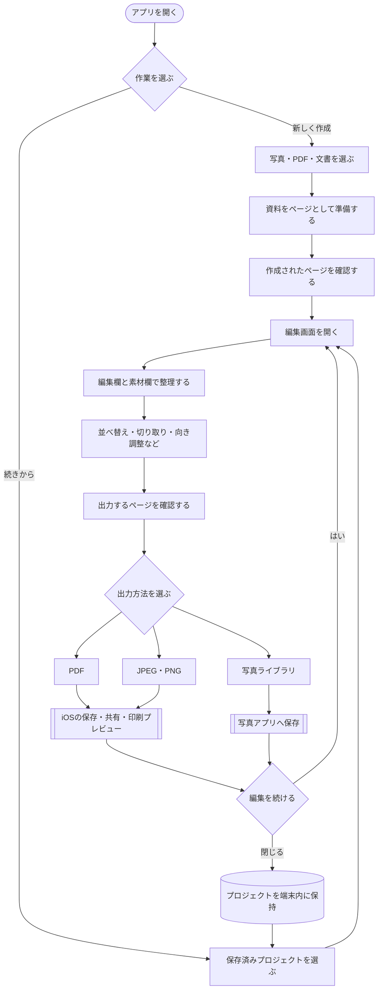

# 利用者フロー

```mermaid
flowchart TD
    Start(["アプリを開く"]) --> Choice{"作業を選ぶ"}
    Choice -->|新しく作成| Import["写真・PDF・文書を選ぶ"]
    Choice -->|続きから| Resume["保存済みプロジェクトを選ぶ"]
    Import --> Prepare["資料をページとして準備する"]
    Prepare --> Review["作成されたページを確認する"]
    Resume --> Editor["編集画面を開く"]
    Review --> Editor
    Editor --> Organize["編集欄と素材欄で整理する"]
    Organize --> Edit["並べ替え・切り取り・向き調整など"]
    Edit --> Check["出力するページを確認する"]
    Check --> Export{"出力方法を選ぶ"}
    Export --> PDF["PDF"]
    Export --> Images["JPEG・PNG"]
    Export --> Photos["写真ライブラリ"]
    PDF --> Share[["iOSの保存・共有・印刷プレビュー"]]
    Images --> Share
    Photos --> SavedPhotos[["写真アプリへ保存"]]
    Share --> Continue{"編集を続ける"}
    SavedPhotos --> Continue
    Continue -->|はい| Editor
    Continue -->|閉じる| Stored[("プロジェクトを端末内に保持")]
    Stored --> Resume
```
